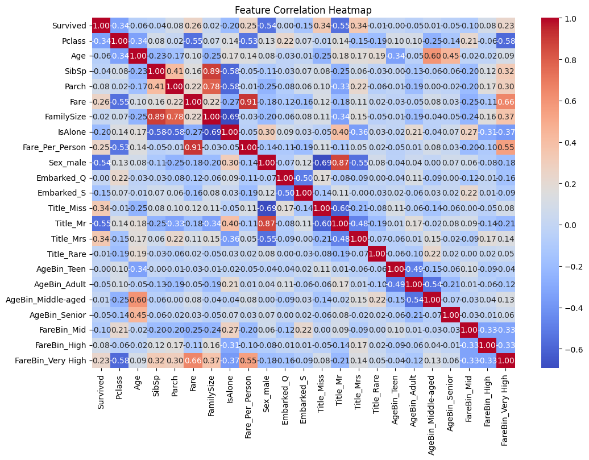
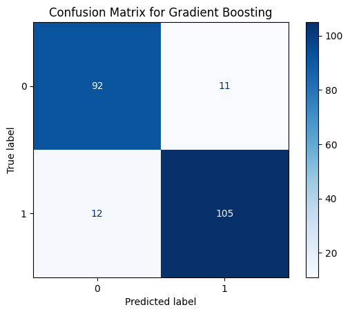
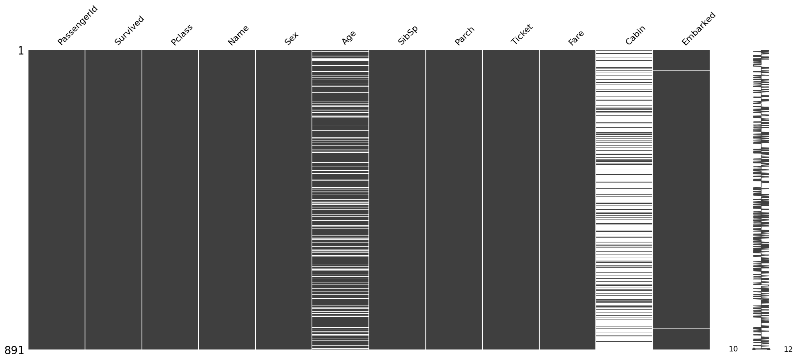
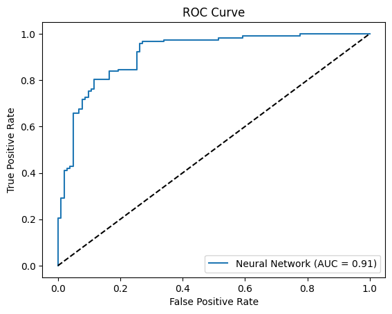
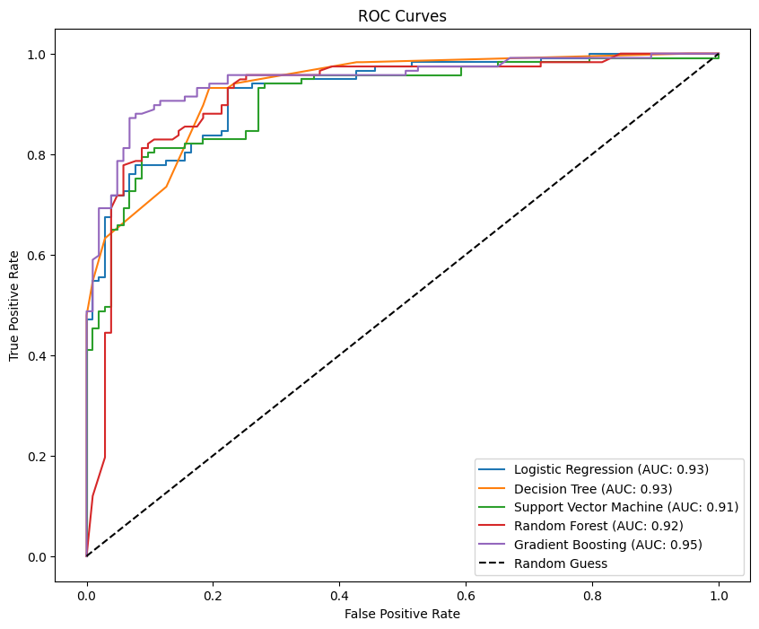

# Titanic Survival Prediction Project

## 1. Exploratory Data Analysis (EDA)

### Dataset Overview
The Titanic dataset includes demographic and passenger details to predict survival rates. The dataset contains attributes such as passenger class, gender, age, fare, and number of family members aboard. Initial inspection of the dataset reveals:

- **Missing Values:**
  - `Age`: Contains missing values, which could impact model accuracy.
  - `Embarked`: Missing values in a small proportion.
  - `Cabin`: High proportion of missing values; decision made to drop.

### Summary Statistics
Key observations from the dataset include:

- **Survival Rate:**
  - Overall survival rate is around 38%.
  - Higher survival rates observed among females and first-class passengers.

- **Passenger Class Influence:**
  - First-class passengers had a significantly higher survival rate than third-class passengers.

- **Gender Impact:**
  - Females had a much higher survival rate than males.

- **Age Distribution:**
  - Younger passengers had a higher survival rate compared to older ones.

### Visualizations
Exploratory visualizations provided insights such as:

- Bar plots showing survival distribution across gender, class, and embarkation ports.
- Box plots highlighting fare and age distributions across survival outcomes.
- Correlation heatmap illustrating relationships between variables.

---

## 2. Data Preparation for ML

### Handling Missing Values

- `Age`: Filled missing values using median imputation.
- `Embarked`: Filled missing values using mode imputation.

### Feature Engineering

- Created `FamilySize` by summing `SibSp` and `Parch` to capture family influence.
- Added `IsAlone` feature to indicate passengers traveling alone.
- Derived `Title`, `Fare_Per_Person`, `AgeBin`, and `FareBin`.
- Used one-hot encoding for additional categorical features.

### Encoding Categorical Variables

- Converted `Sex` and `Embarked` to numerical values using one-hot encoding.

### Feature Selection

Dropped unnecessary columns: `PassengerId`, `Name`, `Ticket`, `Cabin`, which were not predictive.

### Data Splitting

The dataset was split into training and test sets using an 80-20 split.

### Data Imbalance:
- Applied SMOTE to address class imbalance in the Survived column.

### Advanced Metrics:
- Calculated ROC-AUC for the neural network.
- Plotted the ROC Curve for visual evaluation.

---

## 3. ML Model Development

### Models Evaluated

1. **Logistic Regression**
2. **Decision Tree Classifier**
3. **Support Vector Machine (SVM)**
4. **Random Forest Classifier**
5. **Gradient Boosting Classifier**

### Model Evaluation

Performance metrics were assessed using:

- **Accuracy Score:** Measures overall correct predictions.
- **Classification Report:** Provides precision, recall, and F1-score.
- **Confusion Matrix:** Evaluates true vs. false positives/negatives.

### Model Optimization:
- Used cross-validation to evaluate models more reliably.
- Prepared the framework for hyperparameter tuning (e.g., GridSearchCV).

### Key Observations of Feature Correlation Heatmap

1. Survival Correlation
 - Survived vs Sex_male: Strong negative correlation (-0.54). This suggests that being male is negatively associated with survival, indicating females were more likely to survive (consistent with "women and children first" during evacuation).
 - Survived vs Pclass: Moderate negative correlation (-0.34). Passengers in higher classes (e.g., 1st class) were more likely to survive.
 - Survived vs Fare: Moderate positive correlation (0.26). Passengers who paid higher fares (likely in better classes) had higher survival rates.
 - Survived vs Title_Mrs and Title_Miss: Positive correlation, suggesting that women (especially younger or married ones) had better survival chances.
 - Survived vs IsAlone: Weak negative correlation. Passengers traveling alone might have had lower survival rates.
2. Feature Relationships
 - Pclass vs Fare: Strong negative correlation (-0.55). Higher ticket classes correlate with higher fares.
 - FamilySize vs SibSp and Parch: Strong positive correlations (0.89 and ~0.78, respectively). Family size is directly influenced by the number of siblings/spouses and parents/children aboard.
 - FareBin_VeryHigh vs Pclass: Strong negative correlation (-0.66). This highlights the relationship between high fares and first-class passengers.
3. High Correlations (Potential Multicollinearity)
 - SibSp, Parch, and FamilySize: Features are closely related. Including all might introduce redundancy in models sensitive to multicollinearity.
 - FareBin categories and Fare: Strong correlations exist between these derived features, as expected.
 - AgeBin categories and Age: Strong correlation among binned age categories and raw age values.

### Best Model Selection

After evaluation, the best-performing model was:

- **Gradient Boosting Classifier** with an accuracy of 83%, demonstrating superior predictive power.

The selected model was applied to the test dataset and final predictions were saved.

### Neural Network:

- Included a fully connected neural network and evaluated its performance alongside traditional models.

### Comparison:

1. Gradient Boosting Model:
 - Performance Metrics:
    - Accuracy: ~0.90
    - AUC (Area Under the Curve): 0.95
    - F1 Score: ~0.90
 - Observation: This model achieved the highest AUC and accuracy, suggesting it performs best in distinguishing between classes (Survived vs. Not Survived).
2. Other Models:
  - Logistic Regression:
    - AUC: ~0.93
    - Slightly lower accuracy compared to Gradient Boosting but still strong performance.
 - Decision Tree:
    - AUC: ~0.93
    - Strong recall but potentially prone to overfitting compared to ensemble methods.
 - Support Vector Machine (SVM):
    - AUC: ~0.91
    - Lower precision and F1 score than the top-performing models.
 - Random Forest:
    - AUC: ~0.92
    - Robust performance due to ensemble learning but slightly underperformed compared to Gradient Boosting.
3. Neural Network:
 - Performance Metrics:
    - Accuracy: 0.83
    - AUC: ~0.91
 - Observation:
    - The neural network slightly underperformed compared to Gradient Boosting and other traditional models.
    - While neural networks are powerful, they might require more hyperparameter tuning or additional data to achieve better results in this scenario.
4. ROC Curves:
  - The ROC curve for Gradient Boosting is the closest to the top-left corner, indicating its superior ability to balance sensitivity and specificity.
  - Neural Network and Logistic Regression have slightly less steep curves, showing comparable but lower discriminative power.

---

## 4. Ethical Analysis

### Introduction
The Titanic dataset provides an opportunity to analyze survival patterns during the tragic 1912 maritime disaster. However, as with any historical dataset, it reflects societal biases of its time, such as gender, class, and age disparities. Using such data for predictive modeling necessitates a thorough ethical examination.

### Identification of Biases
1. **Gender Bias:**
   - The survival rate for women (approximately 74%) was significantly higher than that for men (approximately 19%). This disparity reflects the "women and children first" policy during evacuation.

2. **Class Bias:**
   - First-class passengers had a survival rate of 62%, compared to 47% for second-class and 24% for third-class passengers. This inequality arose from the proximity of first-class cabins to lifeboats and better access to resources.

3. **Age Bias:**
   - Children had higher survival rates, highlighting prioritization of younger passengers.

### Impact of Bias on Model Fairness
Biases in the dataset can propagate into the ML model, leading to unfair predictions. For instance, a model trained on this data might systematically predict lower survival chances for third-class male passengers, regardless of other factors.

### Trade-offs Between Accuracy and Fairness
Optimizing for accuracy often involves leveraging patterns that reflect historical biases. Ensuring fairness requires addressing these biases, such as balancing the dataset or weighting predictions, potentially at the cost of reduced accuracy.

### Real-world Implications
Using biased models for decision-making could perpetuate inequalities. For example, in resource allocation scenarios, predictions from such models might disadvantage certain groups.

### Ethical Recommendations
1. **Transparency:** Clearly communicate the limitations and biases of the model.
2. **Bias Mitigation:** Explore techniques like re-sampling or fairness-aware algorithms.
3. **Contextual Awareness:** Recognize the historical context of the dataset and avoid applying predictions to modern scenarios without adjustments.
   
---

## 5. Executive Summary

### Project Objectives
The project aimed to build a predictive model to classify Titanic passengers as survivors or non-survivors based on available demographic and ticket-related information.

### Key Steps Undertaken

1. **Exploratory Data Analysis:**
   - Identified key patterns and correlations.
   
2. **Data Preparation:**
   - Addressed missing values, engineered new features, and encoded categorical data.

3. **Model Development:**
   - Compared various machine learning algorithms and selected the best one based on performance metrics.

4. **Ethical Considerations:**
   - Analyzed bias and fairness aspects related to gender and class disparities.
  
Screen Shots

### Key Results

- The Gradient Boosting Classifier achieved the highest accuracy of 83%, making it the best-suited model for deployment.
- Key survival indicators include passenger class, gender, and family size.
