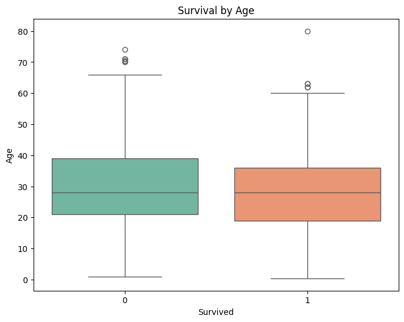
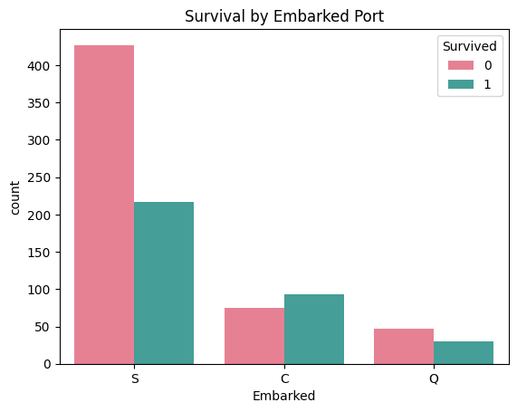

# Titanic - Machine Learning from Disaster
This notebook demonstrates the full machine learning lifecycle on the Titanic dataset.  
The workflow includes:  
1. Exploratory Data Analysis (EDA)  
2. Data Preprocessing and Feature Engineering  
3. Model Training and Evaluation  
4. Ethical Analysis  
5. Model Comparison and Results

Find the
[Referance](https://www.kaggle.com/c/titanic) via this link to the Titanic - Machine Learning from Disaster

⭕⭕⭕⭕ NOTE: Whole documents is split with "TEXT" "CODE" patten, "Run all" for prevent runtime issues. ⭕⭕⭕⭕

## Import Libraries


```python
# Import necessary libraries
import pandas as pd
import numpy as np
import matplotlib.pyplot as plt
import seaborn as sns
from sklearn.model_selection import train_test_split, cross_val_score, GridSearchCV
from sklearn.linear_model import LogisticRegression
from sklearn.tree import DecisionTreeClassifier
from sklearn.svm import SVC
from sklearn.metrics import roc_auc_score, roc_curve, precision_score, recall_score, f1_score, classification_report, confusion_matrix, ConfusionMatrixDisplay
from sklearn.ensemble import RandomForestClassifier, GradientBoostingClassifier, VotingClassifier
from sklearn.metrics import accuracy_score, classification_report, roc_curve, precision_recall_curve
from imblearn.over_sampling import SMOTE  # For handling data imbalance
from google.colab import drive
import missingno as msno
from sklearn.preprocessing import StandardScaler
from sklearn.compose import ColumnTransformer
from sklearn.pipeline import Pipeline
from sklearn.preprocessing import OneHotEncoder
from sklearn.neural_network import MLPClassifier

import warnings
warnings.filterwarnings('ignore')
```

## Connect dataset via Google Drive


```python
# Mount Google Drive
drive.mount('/content/drive')
```

    Drive already mounted at /content/drive; to attempt to forcibly remount, call drive.mount("/content/drive", force_remount=True).


## Load and Titanic Dataset

This section loads the Titanic dataset and performs an initial exploration to understand its structure, missing values, and distributions.


```python
# Paths to the dataset files
train_data_path = "/content/drive/MyDrive/assesment_dataset/train.csv"
test_data_path = "/content/drive/MyDrive/assesment_dataset/test.csv"

# Load the training dataset
df = pd.read_csv(train_data_path)
```

## Exploratory Data Analysis (EDA)


- Data Overview:

  - Prints the first few rows to get a quick look at the dataset.
  - Provides summary statistics for numerical columns.


```python
# Display dataset overview

# 1. Overview of the dataset
print("Dataset Overview:\n", df.info())
print(df.head())
print("\nSummary Statistics:")
print(df.describe())

```

    <class 'pandas.core.frame.DataFrame'>
    RangeIndex: 891 entries, 0 to 890
    Data columns (total 12 columns):
     #   Column       Non-Null Count  Dtype  
    ---  ------       --------------  -----  
     0   PassengerId  891 non-null    int64  
     1   Survived     891 non-null    int64  
     2   Pclass       891 non-null    int64  
     3   Name         891 non-null    object 
     4   Sex          891 non-null    object 
     5   Age          714 non-null    float64
     6   SibSp        891 non-null    int64  
     7   Parch        891 non-null    int64  
     8   Ticket       891 non-null    object 
     9   Fare         891 non-null    float64
     10  Cabin        204 non-null    object 
     11  Embarked     889 non-null    object 
    dtypes: float64(2), int64(5), object(5)
    memory usage: 83.7+ KB
    Dataset Overview:
     None
       PassengerId  Survived  Pclass  \
    0            1         0       3   
    1            2         1       1   
    2            3         1       3   
    3            4         1       1   
    4            5         0       3   
    
                                                    Name     Sex   Age  SibSp  \
    0                            Braund, Mr. Owen Harris    male  22.0      1   
    1  Cumings, Mrs. John Bradley (Florence Briggs Th...  female  38.0      1   
    2                             Heikkinen, Miss. Laina  female  26.0      0   
    3       Futrelle, Mrs. Jacques Heath (Lily May Peel)  female  35.0      1   
    4                           Allen, Mr. William Henry    male  35.0      0   
    
       Parch            Ticket     Fare Cabin Embarked  
    0      0         A/5 21171   7.2500   NaN        S  
    1      0          PC 17599  71.2833   C85        C  
    2      0  STON/O2. 3101282   7.9250   NaN        S  
    3      0            113803  53.1000  C123        S  
    4      0            373450   8.0500   NaN        S  
    
    Summary Statistics:
           PassengerId    Survived      Pclass         Age       SibSp  \
    count   891.000000  891.000000  891.000000  714.000000  891.000000   
    mean    446.000000    0.383838    2.308642   29.699118    0.523008   
    std     257.353842    0.486592    0.836071   14.526497    1.102743   
    min       1.000000    0.000000    1.000000    0.420000    0.000000   
    25%     223.500000    0.000000    2.000000   20.125000    0.000000   
    50%     446.000000    0.000000    3.000000   28.000000    0.000000   
    75%     668.500000    1.000000    3.000000   38.000000    1.000000   
    max     891.000000    1.000000    3.000000   80.000000    8.000000   
    
                Parch        Fare  
    count  891.000000  891.000000  
    mean     0.381594   32.204208  
    std      0.806057   49.693429  
    min      0.000000    0.000000  
    25%      0.000000    7.910400  
    50%      0.000000   14.454200  
    75%      0.000000   31.000000  
    max      6.000000  512.329200  


- Handling Missing Values:

  - Displays the count of missing values for each column.
  - Uses missingno library to visualize missing data patterns.


```python

# 2. Check for missing values
print("\nMissing Values:")
print(df.isnull().sum())

# Visualization of Missing Data
msno.matrix(df)
plt.show()

```

    
    Missing Values:
    PassengerId      0
    Survived         0
    Pclass           0
    Name             0
    Sex              0
    Age            177
    SibSp            0
    Parch            0
    Ticket           0
    Fare             0
    Cabin          687
    Embarked         2
    dtype: int64


    

    


- Target Variable Analysis:

  - Plots the distribution of the survival variable to understand the class balance.


```python
# 3. Visualizing the target variable distribution (e.g., Survival)
sns.countplot(x='Survived', data=df, palette='pastel')
plt.title("Survival Distribution")
plt.show()
```


    

    


- Survival Analysis by Gender:

  - Compares survival rates for male and female passengers using a count plot.


```python
# 4. Analyzing survival by gender
sns.countplot(x='Survived', hue='Sex', data=df, palette='coolwarm')
plt.title("Survival by Gender")
plt.show()
```


    

    


- Survival Analysis by Passenger Class:

 - Examines how class (1st, 2nd, 3rd) affects survival rates.


```python

# 5. Analyzing survival by class
sns.countplot(x='Survived', hue='Pclass', data=df, palette='muted')
plt.title("Survival by Passenger Class")
plt.show()

```


    

    


- Age Distribution:

  - Visualizes the distribution of passenger ages to detect patterns.


```python

# 6. Age distribution analysis
sns.histplot(df['Age'].dropna(), kde=True, bins=30, color='teal')
plt.title("Age Distribution")
plt.show()

```


    

    


- Survival Based on Age
  - Uses boxplots to compare age distributions between survivors and non-survivors.


```python

# 7. Survival based on age
plt.figure(figsize=(8, 6))
sns.boxplot(x='Survived', y='Age', data=df, palette='Set2')
plt.title("Survival by Age")
plt.show()


```


    

    


- Correlation Analysis:
  - Computes and visualizes correlations among numerical features.


```python
# 8. Correlation heatmap
plt.figure(figsize=(10, 6))
sns.heatmap(df.select_dtypes(include=['float64', 'int64']).corr(), annot=True, cmap='coolwarm', fmt='.2f')
plt.title("Feature Correlation Heatmap")
plt.show()

```


    

    


### Insights from the Correlation Heatmap
1. Survival Influencers:

  - Pclass (Passenger Class) shows a strong negative correlation with survival, meaning higher-class passengers had better survival chances.
Fare is positively correlated with survival, indicating wealthier passengers had higher chances of survival.
Age has a slight negative correlation with survival, suggesting younger passengers were more likely to survive.
2. Weak Relationships:

  - Features like SibSp (siblings/spouses aboard) and Parch (parents/children aboard) have weak correlations with survival, meaning they might not strongly influence the outcome individually.
3. Feature Selection Consideration:

  - Based on the correlation values, Pclass, Fare, and Age should be prioritized as key predictors, while low-correlation features may contribute less to model performance.

- Gender-Class Bias:
  - Evaluates gender distribution across different passenger classes.


```python

# 9. Class and gender bias check
plt.figure(figsize=(8, 6))
sns.countplot(x='Pclass', hue='Sex', data=df, palette='viridis')
plt.title("Gender Distribution Across Passenger Classes")
plt.show()
```


    

    


- Fare Distribution:

  - Plots fare prices to identify outliers and distribution patterns.


```python
# 10. Fare distribution analysis
sns.histplot(df['Fare'], kde=True, bins=40, color='purple')
plt.title("Fare Distribution")
plt.show()

```


    

    


- Embarked Port Analysis:
  - Investigates survival rates based on embarkation points (Cherbourg, Queenstown, Southampton).


```python
# 11. Analyzing Embarked feature impact on survival
sns.countplot(x='Embarked', hue='Survived', data=df, palette='husl')
plt.title("Survival by Embarked Port")
plt.show()

```


    

    


- Pairplot Analysis:
  - Generates pairplots to examine relationships between numerical features.


```python

# 12. Pairplot to check relationships
sns.pairplot(df[['Survived', 'Pclass', 'Age', 'Fare']], hue='Survived', palette='husl')
plt.title("Pairplot of Numerical Features")
plt.show()
```


    

    


### Summary of Insights from EDA:
1. Survival Rates Overview:

  - More passengers did not survive compared to those who did.
  - Females had a significantly higher survival rate than males.
2. Class Impact:

  - Passengers in 1st class had higher survival rates, while 3rd class had the lowest.
  - A strong correlation exists between class and survival chances.
3. Age Distribution:

  - Younger passengers, especially children, had higher survival rates.
  - Older passengers had lower survival probabilities.
4. Gender Influence:

  - Women had a survival advantage across all classes.
  - Male survival rate was much lower in comparison.
5. Fare Correlation:

  - Higher fares were associated with increased survival, indicating wealthier passengers had better chances.
6. Embarkation Analysis:

  - Passengers who embarked from Cherbourg (C) had higher survival rates compared to Southampton (S) and Queenstown (Q).

## Distribution of ages for survivors and non-survivors?


```python
# Remove missing values in Age column for analysis
df_age = df.dropna(subset=['Age'])

# 1. Histogram of age distribution for survivors and non-survivors
plt.figure(figsize=(10, 6))
sns.histplot(df_age[df_age['Survived'] == 1]['Age'], bins=30, kde=True, color='green', label='Survived')
sns.histplot(df_age[df_age['Survived'] == 0]['Age'], bins=30, kde=True, color='red', label='Did Not Survive')
plt.title("Age Distribution by Survival")
plt.xlabel("Age")
plt.ylabel("Count")
plt.legend()
plt.show()

print("")

# 2. Boxplot for survival based on age
plt.figure(figsize=(8, 6))
sns.boxplot(x='Survived', y='Age', data=df_age, palette='Set2')
plt.title("Boxplot of Age Distribution by Survival")
plt.xlabel("Survival (0 = No, 1 = Yes)")
plt.ylabel("Age")
plt.show()

print("")

# 3. Kernel Density Estimate (KDE) plot to visualize survival trends by age
plt.figure(figsize=(10, 6))
sns.kdeplot(df_age[df_age['Survived'] == 1]['Age'], color='blue', label='Survived', fill=True)
sns.kdeplot(df_age[df_age['Survived'] == 0]['Age'], color='orange', label='Did Not Survive', fill=True)
plt.title("KDE Plot of Age Distribution by Survival")
plt.xlabel("Age")
plt.ylabel("Density")
plt.legend()
plt.show()

```


    

    


    


    

    


    


    

    


#### Insights from the Age Distribution Analysis:
1. Younger Passengers Had Higher Survival Rates:

  - The histogram and KDE plot show a higher concentration of survivors in younger age groups, indicating that children were prioritized for rescue (e.g., "women and children first" policy).
2. Older Passengers Had Lower Survival Rates:

  - The survival rate declines with age, especially for passengers above 50 years, who had a higher non-survival rate.
3. Median Age Difference:

  - The boxplot reveals that survivors had a lower median age compared to non-survivors.
A wider spread of ages is seen among non-survivors, indicating age was a factor in survival outcomes.
4. Potential for Feature Engineering:

  - The clear distinction between age groups suggests creating categorical age bins (e.g., children, adults, seniors) might improve predictive modeling.
5. Missing Age Value Imputation:

  - The observed age distribution patterns can help in imputing missing values based on survival trends (e.g., filling missing ages with median values of their passenger class or gender).


## Data Cleaning and Handling Missing Values:

 - Handling Missing Ages
 - Handling Missing Embarked Values with most common value
 - Dropping Irrelevant Columns
 - Encoding Categorical Variables
 - Handling Missing Fare Values

> ⏰ 📓 Note: Run 'Load and Titanic Dataset' in case of runtine error.


```python
# Check for missing values in the dataset
print("Missing values before handling:")
print(df.isnull().sum())

# 1. Create new column for Age and handle missing values based on median of each Pclass
df['Processed_Age'] = df['Age']  # Preserve original column
df = df.reset_index(drop=True)  # Reset index
df['Processed_Age'] = df.groupby('Pclass')['Processed_Age'].transform(lambda x: x.fillna(x.median()))

# 2. Create new column for Embarked and fill missing values with the most frequent embarkation point
if 'Embarked' in df.columns:
    df['Processed_Embarked'] = df['Embarked']  # Preserve original column
    most_common_embarked = df['Processed_Embarked'].mode()[0]
    print(f"The most common embarkation point is: {most_common_embarked}")
    df['Processed_Embarked'].fillna(most_common_embarked, inplace=True)

# 3. Drop Cabin column and create a new feature for missing Cabin
if 'Cabin' in df.columns:
    df['Cabin_Missing'] = df['Cabin'].isnull().astype(int)  # Flag for missing Cabin
    df['Cabin_Class'] = df['Cabin'].apply(lambda x: x[0] if pd.notnull(x) else 'U')  # Extract first letter or 'U' for unknown
    df.drop(columns=['Cabin'], inplace=True)

# 4. Convert categorical variables to numeric (Sex and Embarked)
if 'Sex' in df.columns:
    df['Processed_Sex'] = df['Sex'].map({'male': 0, 'female': 1})

if 'Processed_Embarked' in df.columns:
    df = pd.get_dummies(df, columns=['Processed_Embarked'], prefix='Embarked', drop_first=True)

# 5. Create new column for Fare and handle missing values
df['Processed_Fare'] = df['Fare']
df['Processed_Fare'].fillna(df.groupby('Pclass')['Processed_Fare'].transform('median'), inplace=True)

# Final check for missing values
print("Missing values after handling:")
print(df.isnull().sum())

# Display the cleaned dataset
print("Dataset after cleaning:")
print(df.head())
```

    Missing values before handling:
    PassengerId      0
    Survived         0
    Pclass           0
    Name             0
    Sex              0
    Age            177
    SibSp            0
    Parch            0
    Ticket           0
    Fare             0
    Cabin          687
    Embarked         2
    dtype: int64
    The most common embarkation point is: S
    Missing values after handling:
    PassengerId         0
    Survived            0
    Pclass              0
    Name                0
    Sex                 0
    Age               177
    SibSp               0
    Parch               0
    Ticket              0
    Fare                0
    Embarked            2
    Processed_Age       0
    Cabin_Missing       0
    Cabin_Class         0
    Processed_Sex       0
    Embarked_Q          0
    Embarked_S          0
    Processed_Fare      0
    dtype: int64
    Dataset after cleaning:
       PassengerId  Survived  Pclass  \
    0            1         0       3   
    1            2         1       1   
    2            3         1       3   
    3            4         1       1   
    4            5         0       3   
    
                                                    Name     Sex   Age  SibSp  \
    0                            Braund, Mr. Owen Harris    male  22.0      1   
    1  Cumings, Mrs. John Bradley (Florence Briggs Th...  female  38.0      1   
    2                             Heikkinen, Miss. Laina  female  26.0      0   
    3       Futrelle, Mrs. Jacques Heath (Lily May Peel)  female  35.0      1   
    4                           Allen, Mr. William Henry    male  35.0      0   
    
       Parch            Ticket     Fare Embarked  Processed_Age  Cabin_Missing  \
    0      0         A/5 21171   7.2500        S           22.0              1   
    1      0          PC 17599  71.2833        C           38.0              0   
    2      0  STON/O2. 3101282   7.9250        S           26.0              1   
    3      0            113803  53.1000        S           35.0              0   
    4      0            373450   8.0500        S           35.0              1   
    
      Cabin_Class  Processed_Sex  Embarked_Q  Embarked_S  Processed_Fare  
    0           U              0       False        True          7.2500  
    1           C              1       False       False         71.2833  
    2           U              1       False        True          7.9250  
    3           C              1       False        True         53.1000  
    4           U              0       False        True          8.0500  


- Visualize missing values


```python
# Visualize missing values
plt.figure(figsize=(10, 6))
sns.heatmap(df.isnull(), cbar=False, cmap="viridis")
plt.title("Missing Values Heatmap")
plt.show()

# make gap
print("")

sns.histplot(df['Processed_Age'], kde=True, bins=30, color="blue")
plt.title("Processed Age Distribution")
plt.xlabel("Age")
plt.ylabel("Frequency")
plt.show()

# make gap
print("")

# Embarked Distribution
embarked_cols = [col for col in df.columns if 'Embarked' in col]
embarked_counts = df[embarked_cols].sum(numeric_only=True)  # Ensure only numeric columns are summed
embarked_counts.plot(kind='bar', color=['blue', 'orange'], figsize=(8, 6))
plt.title("Embarked Distribution")
plt.xlabel("Embarked Categories")
plt.ylabel("Count")
plt.show()
```


    

    


    


    

    


    


    

    


## Feature Engineering

  - Creating a binary feature "IsAlone": 1 if passenger is alone, 0 otherwise
  - Creating a new feature "FamilySize" that combines siblings/spouses and parents/children onboard
  - +1 accounts for the passenger themselves
  - Dropping Unnecessary Columns
  - Splitting Features and Target Variable
  - Encoding Categorical Variables
  - Scaling Numerical Features
  - Combining Preprocessing Steps


```python
# 1. Extract titles from the Name column
df['Title'] = df['Name'].apply(lambda x: x.split(',')[1].split('.')[0].strip())

# 2. Create binary features based on titles
title_mapping = {'Mr': 'Is_Mr', 'Mrs': 'Is_Mrs', 'Miss': 'Is_Miss', 'Master': 'Is_Master', 'Dr': 'Is_Dr'}
for title, col_name in title_mapping.items():
    df[col_name] = df['Title'].apply(lambda x: 1 if x == title else 0)

# 3. Family size and IsAlone
# Adjusting Family_Size to include the passenger themselves
df['Family_Size'] = df['SibSp'] + df['Parch'] + 1 # Adding 1 for the passenger themselves
# re-calculate IsAlone based on the updated Family_Size
df['IsAlone'] = df['Family_Size'].apply(lambda x: 1 if x == 1 else 0)

# 4. Fare per person
df['Fare_Per_Person'] = df['Processed_Fare'] / df['Family_Size']

# 5. Ticket length (length of the ticket string)
df['Ticket_Length'] = df['Ticket'].apply(lambda x: len(str(x)))

# 6. Interaction between Age and Pclass
df['Age_x_Pclass'] = df['Processed_Age'] * df['Pclass']

# 7. Fare and Embarked interaction (if Embarked columns exist)
if 'Embarked_S' in df.columns:
    df['Fare_x_Embarked_S'] = df['Processed_Fare'] * df['Embarked_S']
if 'Embarked_Q' in df.columns:
    df['Fare_x_Embarked_Q'] = df['Processed_Fare'] * df['Embarked_Q']

# 8 Dropping unnecessary columns
columns_to_drop = ['Cabin', 'Name', 'Ticket', 'Title']
df.drop(columns=[col for col in columns_to_drop if col in df.columns], inplace=True)

# 9 Splitting features and target variable
X = df.drop(columns=['Survived'])
y = df['Survived']

# 10 Encoding categorical variables and scaling numerical features
categorical_columns = ['Processed_Sex', 'Embarked_S', 'Embarked_Q', 'Cabin_Class']
numerical_columns = ['Processed_Age', 'Processed_Fare', 'Family_Size', 'Fare_Per_Person', 'Age_x_Pclass']

preprocessor = ColumnTransformer([
    ('num', StandardScaler(), numerical_columns),
    ('cat', OneHotEncoder(drop='first'), categorical_columns)
])

# 11 Scaling numerical features
scaler = StandardScaler()
X[numerical_columns] = scaler.fit_transform(X[numerical_columns])

# 12 Preprocessor: combines scaling for numerical columns and one-hot encoding for categorical columns
preprocessor = ColumnTransformer([
    ('num', StandardScaler(), numerical_columns),
    ('cat', 'passthrough', categorical_columns)
])

```

- Newly Engineered Features Visualize
  - Family Size and IsAlone
  - Fare Per Person
  - Age x Pclass Interaction
  - Feature Correlation


```python
# Family Size and IsAlone
sns.countplot(x='Family_Size', hue='IsAlone', data=df, palette="Set2")
plt.title("Family Size vs. IsAlone")
plt.xlabel("Family Size")
plt.ylabel("Count")
plt.legend(title="IsAlone")
plt.show()

print("")

# Fare Per Person
sns.histplot(df['Fare_Per_Person'], kde=True, bins=30, color="green")
plt.title("Fare Per Person Distribution")
plt.xlabel("Fare Per Person")
plt.ylabel("Frequency")
plt.show()

print("")

# Age x Pclass Interaction
sns.boxplot(x='Pclass', y='Age_x_Pclass', data=df, palette="Set3")
plt.title("Age x Pclass Interaction")
plt.xlabel("Passenger Class")
plt.ylabel("Age x Pclass")
plt.show()

# Feature Correlation

# Check for non-numeric columns
non_numeric_columns = df.select_dtypes(include=['object']).columns
print("Non-numeric columns:", non_numeric_columns)

# Encode 'Sex' if it's still categorical
if 'Sex' in df.columns:
    df['Sex'] = df['Sex'].map({'male': 0, 'female': 1}).astype(int)

# Ensure Embarked columns exist and are encoded correctly
if 'Embarked' in df.columns:
    df = pd.get_dummies(df, columns=['Embarked'], prefix='Embarked', drop_first=True)

# Double-check if any non-numeric values remain
print("Non-numeric columns after processing:", df.select_dtypes(include=['object']).columns)

# Drop non-numeric columns if they still exist
df_numeric = df.select_dtypes(include=['number'])


plt.figure(figsize=(12, 8))
sns.heatmap(df_numeric.corr(), annot=True, fmt=".2f", cmap="coolwarm", cbar=True)
plt.title("Feature Correlation Heatmap")
plt.show()

# Verify One-Hot Encoding
print("Processed Embarked Columns:")
print([col for col in df.columns if 'Embarked' in col])

# Visualize Target Variable (y)
sns.countplot(x=y, palette="viridis")
plt.title("Survived Distribution")
plt.xlabel("Survived")
plt.ylabel("Count")
plt.show()

```


    

    


    


    

    


    


    

    


    Non-numeric columns: Index(['Sex', 'Embarked', 'Cabin_Class'], dtype='object')
    Non-numeric columns after processing: Index(['Cabin_Class'], dtype='object')


    

    


    Processed Embarked Columns:
    ['Embarked_Q', 'Embarked_S', 'Fare_x_Embarked_S', 'Fare_x_Embarked_Q', 'Embarked_Q', 'Embarked_S']


    

    


## Model Development
- Splitting the dataset
- Dictionary of models to train and evaluate
- Evaluate each model


```python
# Splitting the dataset
X_train, X_test, y_train, y_test = train_test_split(X, y, test_size=0.2, random_state=42)

# models
models = {
    'Logistic Regression': LogisticRegression(max_iter=500),
    'Decision Tree': DecisionTreeClassifier(),
    'SVM': SVC(probability=True),
    'Random Forest': RandomForestClassifier(),
    'Gradient Boosting': GradientBoostingClassifier()
}

# Update the ColumnTransformer to encode categorical features
categorical_columns = ['Processed_Sex', 'Embarked_S', 'Embarked_Q', 'Cabin_Class']
numerical_columns = ['Processed_Age', 'Processed_Fare', 'Family_Size', 'Fare_Per_Person', 'Age_x_Pclass']

preprocessor = ColumnTransformer([
    ('num', StandardScaler(), numerical_columns),
    ('cat', OneHotEncoder(handle_unknown='ignore', drop='first'), categorical_columns)
])

# Evaluate each model
results = {}

for name, model in models.items():
    pipeline = Pipeline([
        ('preprocessor', preprocessor),
        ('classifier', model)
    ])

    # Train the model
    pipeline.fit(X_train, y_train)

    # Predict on test set
    y_pred = pipeline.predict(X_test)

    # Evaluate accuracy
    accuracy = accuracy_score(y_test, y_pred)
    results[name] = accuracy

    print(f"{name} Accuracy: {accuracy:.4f}")
    print(classification_report(y_test, y_pred))

# Neural Network Implementation
def create_nn(input_dim):
    model = Sequential([
        Dense(128, activation='relu', input_dim=input_dim),
        Dropout(0.3),
        Dense(64, activation='relu'),
        Dropout(0.3),
        Dense(1, activation='sigmoid')  # Binary classification output layer
    ])
    model.compile(optimizer=Adam(learning_rate=0.001), loss='binary_crossentropy', metrics=['accuracy'])
    return model

# Preprocess the data for neural network
X_train_nn = preprocessor.fit_transform(X_train)
X_test_nn = preprocessor.transform(X_test)

# Create and train the neural network
nn_model = create_nn(X_train_nn.shape[1])
nn_history = nn_model.fit(X_train_nn, y_train, validation_split=0.2, epochs=50, batch_size=32, verbose=1)

# Evaluate the neural network
nn_accuracy = nn_model.evaluate(X_test_nn, y_test, verbose=0)[1]
results['Neural Network'] = nn_accuracy
print(f"\nNeural Network Accuracy: {nn_accuracy:.4f}")

print("Model evaluation complete.")

```

    Logistic Regression Accuracy: 0.8045
                  precision    recall  f1-score   support
    
               0       0.82      0.86      0.84       105
               1       0.78      0.73      0.76        74
    
        accuracy                           0.80       179
       macro avg       0.80      0.79      0.80       179
    weighted avg       0.80      0.80      0.80       179
    
    Decision Tree Accuracy: 0.7486
                  precision    recall  f1-score   support
    
               0       0.81      0.75      0.78       105
               1       0.68      0.74      0.71        74
    
        accuracy                           0.75       179
       macro avg       0.74      0.75      0.74       179
    weighted avg       0.75      0.75      0.75       179
    
    SVM Accuracy: 0.8045
                  precision    recall  f1-score   support
    
               0       0.81      0.87      0.84       105
               1       0.79      0.72      0.75        74
    
        accuracy                           0.80       179
       macro avg       0.80      0.79      0.80       179
    weighted avg       0.80      0.80      0.80       179
    
    Random Forest Accuracy: 0.8045
                  precision    recall  f1-score   support
    
               0       0.83      0.84      0.83       105
               1       0.77      0.76      0.76        74
    
        accuracy                           0.80       179
       macro avg       0.80      0.80      0.80       179
    weighted avg       0.80      0.80      0.80       179
    
    Gradient Boosting Accuracy: 0.8380
                  precision    recall  f1-score   support
    
               0       0.85      0.88      0.86       105
               1       0.82      0.78      0.80        74
    
        accuracy                           0.84       179
       macro avg       0.83      0.83      0.83       179
    weighted avg       0.84      0.84      0.84       179
    
    Epoch 1/50
    18/18 ━━━━━━━━━━━━━━━━━━━━ 3s 24ms/step - accuracy: 0.4756 - loss: 0.7179 - val_accuracy: 0.6993 - val_loss: 0.6041
    Epoch 2/50
    18/18 ━━━━━━━━━━━━━━━━━━━━ 0s 4ms/step - accuracy: 0.6438 - loss: 0.6068 - val_accuracy: 0.6993 - val_loss: 0.5446
    Epoch 3/50
    18/18 ━━━━━━━━━━━━━━━━━━━━ 0s 4ms/step - accuracy: 0.7242 - loss: 0.5585 - val_accuracy: 0.7133 - val_loss: 0.5069
    Epoch 4/50
    18/18 ━━━━━━━━━━━━━━━━━━━━ 0s 4ms/step - accuracy: 0.7534 - loss: 0.5329 - val_accuracy: 0.7273 - val_loss: 0.4746
    Epoch 5/50
    18/18 ━━━━━━━━━━━━━━━━━━━━ 0s 4ms/step - accuracy: 0.7481 - loss: 0.5317 - val_accuracy: 0.8112 - val_loss: 0.4395
    Epoch 6/50
    18/18 ━━━━━━━━━━━━━━━━━━━━ 0s 4ms/step - accuracy: 0.7717 - loss: 0.4752 - val_accuracy: 0.8182 - val_loss: 0.4248
    Epoch 7/50
    18/18 ━━━━━━━━━━━━━━━━━━━━ 0s 5ms/step - accuracy: 0.8049 - loss: 0.4510 - val_accuracy: 0.8322 - val_loss: 0.4142
    Epoch 8/50
    18/18 ━━━━━━━━━━━━━━━━━━━━ 0s 4ms/step - accuracy: 0.8033 - loss: 0.4587 - val_accuracy: 0.8322 - val_loss: 0.4054
    Epoch 9/50
    18/18 ━━━━━━━━━━━━━━━━━━━━ 0s 5ms/step - accuracy: 0.8226 - loss: 0.4210 - val_accuracy: 0.8182 - val_loss: 0.4082
    Epoch 10/50
    18/18 ━━━━━━━━━━━━━━━━━━━━ 0s 4ms/step - accuracy: 0.8165 - loss: 0.4412 - val_accuracy: 0.8392 - val_loss: 0.4075
    Epoch 11/50
    18/18 ━━━━━━━━━━━━━━━━━━━━ 0s 5ms/step - accuracy: 0.7683 - loss: 0.4678 - val_accuracy: 0.8252 - val_loss: 0.4069
    Epoch 12/50
    18/18 ━━━━━━━━━━━━━━━━━━━━ 0s 5ms/step - accuracy: 0.7965 - loss: 0.4373 - val_accuracy: 0.8392 - val_loss: 0.4069
    Epoch 13/50
    18/18 ━━━━━━━━━━━━━━━━━━━━ 0s 5ms/step - accuracy: 0.8146 - loss: 0.4424 - val_accuracy: 0.8392 - val_loss: 0.3995
    Epoch 14/50
    18/18 ━━━━━━━━━━━━━━━━━━━━ 0s 7ms/step - accuracy: 0.8266 - loss: 0.4554 - val_accuracy: 0.8462 - val_loss: 0.4033
    Epoch 15/50
    18/18 ━━━━━━━━━━━━━━━━━━━━ 0s 6ms/step - accuracy: 0.8407 - loss: 0.4192 - val_accuracy: 0.8392 - val_loss: 0.4021
    Epoch 16/50
    18/18 ━━━━━━━━━━━━━━━━━━━━ 0s 7ms/step - accuracy: 0.8168 - loss: 0.4362 - val_accuracy: 0.8392 - val_loss: 0.4101
    Epoch 17/50
    18/18 ━━━━━━━━━━━━━━━━━━━━ 0s 7ms/step - accuracy: 0.8437 - loss: 0.3852 - val_accuracy: 0.8462 - val_loss: 0.4058
    Epoch 18/50
    18/18 ━━━━━━━━━━━━━━━━━━━━ 0s 6ms/step - accuracy: 0.8448 - loss: 0.3697 - val_accuracy: 0.8462 - val_loss: 0.4070
    Epoch 19/50
    18/18 ━━━━━━━━━━━━━━━━━━━━ 0s 6ms/step - accuracy: 0.8378 - loss: 0.3863 - val_accuracy: 0.8462 - val_loss: 0.4136
    Epoch 20/50
    18/18 ━━━━━━━━━━━━━━━━━━━━ 0s 7ms/step - accuracy: 0.8296 - loss: 0.4086 - val_accuracy: 0.8462 - val_loss: 0.4176
    Epoch 21/50
    18/18 ━━━━━━━━━━━━━━━━━━━━ 0s 6ms/step - accuracy: 0.7883 - loss: 0.4651 - val_accuracy: 0.8462 - val_loss: 0.4120
    Epoch 22/50
    18/18 ━━━━━━━━━━━━━━━━━━━━ 0s 6ms/step - accuracy: 0.8279 - loss: 0.4040 - val_accuracy: 0.8462 - val_loss: 0.4140
    Epoch 23/50
    18/18 ━━━━━━━━━━━━━━━━━━━━ 0s 8ms/step - accuracy: 0.8415 - loss: 0.3805 - val_accuracy: 0.8462 - val_loss: 0.4098
    Epoch 24/50
    18/18 ━━━━━━━━━━━━━━━━━━━━ 0s 7ms/step - accuracy: 0.8226 - loss: 0.4385 - val_accuracy: 0.8462 - val_loss: 0.4198
    Epoch 25/50
    18/18 ━━━━━━━━━━━━━━━━━━━━ 0s 6ms/step - accuracy: 0.8470 - loss: 0.3745 - val_accuracy: 0.8462 - val_loss: 0.4161
    Epoch 26/50
    18/18 ━━━━━━━━━━━━━━━━━━━━ 0s 8ms/step - accuracy: 0.8313 - loss: 0.4034 - val_accuracy: 0.8531 - val_loss: 0.4179
    Epoch 27/50
    18/18 ━━━━━━━━━━━━━━━━━━━━ 0s 7ms/step - accuracy: 0.8271 - loss: 0.3892 - val_accuracy: 0.8392 - val_loss: 0.4204
    Epoch 28/50
    18/18 ━━━━━━━━━━━━━━━━━━━━ 0s 9ms/step - accuracy: 0.8068 - loss: 0.4107 - val_accuracy: 0.8462 - val_loss: 0.4194
    Epoch 29/50
    18/18 ━━━━━━━━━━━━━━━━━━━━ 0s 5ms/step - accuracy: 0.8295 - loss: 0.4078 - val_accuracy: 0.8462 - val_loss: 0.4314
    Epoch 30/50
    18/18 ━━━━━━━━━━━━━━━━━━━━ 0s 5ms/step - accuracy: 0.8438 - loss: 0.3731 - val_accuracy: 0.8462 - val_loss: 0.4274
    Epoch 31/50
    18/18 ━━━━━━━━━━━━━━━━━━━━ 0s 4ms/step - accuracy: 0.8445 - loss: 0.3771 - val_accuracy: 0.8462 - val_loss: 0.4273
    Epoch 32/50
    18/18 ━━━━━━━━━━━━━━━━━━━━ 0s 4ms/step - accuracy: 0.8475 - loss: 0.3427 - val_accuracy: 0.8462 - val_loss: 0.4239
    Epoch 33/50
    18/18 ━━━━━━━━━━━━━━━━━━━━ 0s 4ms/step - accuracy: 0.8224 - loss: 0.4163 - val_accuracy: 0.8531 - val_loss: 0.4353
    Epoch 34/50
    18/18 ━━━━━━━━━━━━━━━━━━━━ 0s 6ms/step - accuracy: 0.8478 - loss: 0.3737 - val_accuracy: 0.8462 - val_loss: 0.4287
    Epoch 35/50
    18/18 ━━━━━━━━━━━━━━━━━━━━ 0s 4ms/step - accuracy: 0.8129 - loss: 0.4174 - val_accuracy: 0.8462 - val_loss: 0.4363
    Epoch 36/50
    18/18 ━━━━━━━━━━━━━━━━━━━━ 0s 5ms/step - accuracy: 0.8560 - loss: 0.3738 - val_accuracy: 0.8462 - val_loss: 0.4265
    Epoch 37/50
    18/18 ━━━━━━━━━━━━━━━━━━━━ 0s 4ms/step - accuracy: 0.8552 - loss: 0.3421 - val_accuracy: 0.8462 - val_loss: 0.4341
    Epoch 38/50
    18/18 ━━━━━━━━━━━━━━━━━━━━ 0s 5ms/step - accuracy: 0.8232 - loss: 0.3827 - val_accuracy: 0.8462 - val_loss: 0.4316
    Epoch 39/50
    18/18 ━━━━━━━━━━━━━━━━━━━━ 0s 4ms/step - accuracy: 0.8187 - loss: 0.4182 - val_accuracy: 0.8392 - val_loss: 0.4297
    Epoch 40/50
    18/18 ━━━━━━━━━━━━━━━━━━━━ 0s 5ms/step - accuracy: 0.8462 - loss: 0.3572 - val_accuracy: 0.8462 - val_loss: 0.4405
    Epoch 41/50
    18/18 ━━━━━━━━━━━━━━━━━━━━ 0s 4ms/step - accuracy: 0.8335 - loss: 0.3852 - val_accuracy: 0.8462 - val_loss: 0.4412
    Epoch 42/50
    18/18 ━━━━━━━━━━━━━━━━━━━━ 0s 5ms/step - accuracy: 0.8599 - loss: 0.3372 - val_accuracy: 0.8462 - val_loss: 0.4514
    Epoch 43/50
    18/18 ━━━━━━━━━━━━━━━━━━━━ 0s 4ms/step - accuracy: 0.8720 - loss: 0.3388 - val_accuracy: 0.8462 - val_loss: 0.4437
    Epoch 44/50
    18/18 ━━━━━━━━━━━━━━━━━━━━ 0s 4ms/step - accuracy: 0.8600 - loss: 0.3416 - val_accuracy: 0.8531 - val_loss: 0.4524
    Epoch 45/50
    18/18 ━━━━━━━━━━━━━━━━━━━━ 0s 4ms/step - accuracy: 0.7937 - loss: 0.4116 - val_accuracy: 0.8462 - val_loss: 0.4524
    Epoch 46/50
    18/18 ━━━━━━━━━━━━━━━━━━━━ 0s 4ms/step - accuracy: 0.8341 - loss: 0.3992 - val_accuracy: 0.8392 - val_loss: 0.4491
    Epoch 47/50
    18/18 ━━━━━━━━━━━━━━━━━━━━ 0s 4ms/step - accuracy: 0.8510 - loss: 0.3573 - val_accuracy: 0.8601 - val_loss: 0.4641
    Epoch 48/50
    18/18 ━━━━━━━━━━━━━━━━━━━━ 0s 4ms/step - accuracy: 0.8594 - loss: 0.3515 - val_accuracy: 0.8531 - val_loss: 0.4608
    Epoch 49/50
    18/18 ━━━━━━━━━━━━━━━━━━━━ 0s 5ms/step - accuracy: 0.8565 - loss: 0.3573 - val_accuracy: 0.8531 - val_loss: 0.4551
    Epoch 50/50
    18/18 ━━━━━━━━━━━━━━━━━━━━ 0s 4ms/step - accuracy: 0.8333 - loss: 0.3855 - val_accuracy: 0.8531 - val_loss: 0.4547
    
    Neural Network Accuracy: 0.8045
    Model evaluation complete.


## Let's see model model performance
- Accuracy, Precision, Recall, F1-Score, ROC-AUC
- Additional Evaluation
- Probability Predictions
- Displaying Results in a DataFrame


```python
# Initialize an empty dictionary to store evaluation metrics
metrics = {}

# Evaluate each model
for name, model in models.items():
    pipeline = Pipeline([
        ('preprocessor', preprocessor),
        ('classifier', model)
    ])

    # Train the model
    pipeline.fit(X_train, y_train)

    # Predict probabilities on the test set for ROC-AUC
    y_pred_proba = pipeline.predict_proba(X_test)[:, 1]  # Getting probabilities for the positive class

    # Predict labels on the test set for other metrics
    y_pred = pipeline.predict(X_test)

    # Calculate evaluation metrics
    accuracy = accuracy_score(y_test, y_pred)
    precision = precision_score(y_test, y_pred)
    recall = recall_score(y_test, y_pred)
    f1 = f1_score(y_test, y_pred)
    roc_auc = roc_auc_score(y_test, y_pred_proba)

    # Store the metrics
    metrics[name] = {
        'Accuracy': accuracy,
        'Precision': precision,
        'Recall': recall,
        'F1-Score': f1,
        'ROC-AUC': roc_auc
    }

# Neural Network Implementation (with probability predictions)
y_pred_proba_nn = nn_model.predict(X_test_nn).flatten()  # Neural network prediction probabilities (flattened for binary classification)
y_pred_nn = (y_pred_proba_nn > 0.5).astype(int)  # Convert to binary labels based on threshold

# Calculate metrics for Neural Network
nn_accuracy = accuracy_score(y_test, y_pred_nn)
nn_precision = precision_score(y_test, y_pred_nn)
nn_recall = recall_score(y_test, y_pred_nn)
nn_f1 = f1_score(y_test, y_pred_nn)
nn_roc_auc = roc_auc_score(y_test, y_pred_proba_nn)

# Store NN metrics
metrics['Neural Network'] = {
    'Accuracy': nn_accuracy,
    'Precision': nn_precision,
    'Recall': nn_recall,
    'F1-Score': nn_f1,
    'ROC-AUC': nn_roc_auc
}

# Convert results dictionary to DataFrame for better visualization
metrics_df = pd.DataFrame(metrics).T  # Transpose for better format

# Display the results
print("Model Evaluation Results:")
print(metrics_df)

```

    WARNING:tensorflow:5 out of the last 13 calls to <function TensorFlowTrainer.make_predict_function.<locals>.one_step_on_data_distributed at 0x7a9329299e40> triggered tf.function retracing. Tracing is expensive and the excessive number of tracings could be due to (1) creating @tf.function repeatedly in a loop, (2) passing tensors with different shapes, (3) passing Python objects instead of tensors. For (1), please define your @tf.function outside of the loop. For (2), @tf.function has reduce_retracing=True option that can avoid unnecessary retracing. For (3), please refer to https://www.tensorflow.org/guide/function#controlling_retracing and https://www.tensorflow.org/api_docs/python/tf/function for  more details.


    6/6 ━━━━━━━━━━━━━━━━━━━━ 0s 14ms/step
    Model Evaluation Results:
                         Accuracy  Precision    Recall  F1-Score   ROC-AUC
    Logistic Regression  0.804469   0.782609  0.729730  0.755245  0.876319
    Decision Tree        0.776536   0.717949  0.756757  0.736842  0.779408
    SVM                  0.804469   0.791045  0.716216  0.751773  0.843115
    Random Forest        0.815642   0.780822  0.770270  0.775510  0.909138
    Gradient Boosting    0.832402   0.805556  0.783784  0.794521  0.894402
    Neural Network       0.804469   0.774648  0.743243  0.758621  0.869627


## Results Visualizations


```python
# Convert results into a DataFrame for visualization
metrics_df = pd.DataFrame(metrics).T  # Transpose for better format

# Plotting the evaluation metrics (Bar plot)
metrics_df.plot(kind='bar', figsize=(12, 8), colormap='viridis', edgecolor='black')
plt.title("Model Performance Comparison")
plt.ylabel("Score")
plt.xlabel("Model")
plt.xticks(rotation=45)
plt.tight_layout()
plt.show()

print("")

# Plotting ROC-AUC comparison
plt.figure(figsize=(10, 6))
for name, model in models.items():
    # Get probability predictions for ROC curve
    pipeline = Pipeline([
        ('preprocessor', preprocessor),
        ('classifier', model)
    ])
    pipeline.fit(X_train, y_train)
    y_pred_proba = pipeline.predict_proba(X_test)[:, 1]

    # Plot the ROC curve for each model
    fpr, tpr, _ = roc_curve(y_test, y_pred_proba)
    plt.plot(fpr, tpr, label=f'{name} (AUC = {roc_auc_score(y_test, y_pred_proba):.2f})')

# Neural Network ROC-AUC curve
fpr_nn, tpr_nn, _ = roc_curve(y_test, y_pred_proba_nn)
plt.plot(fpr_nn, tpr_nn, label=f'Neural Network (AUC = {nn_roc_auc:.2f})')

plt.plot([0, 1], [0, 1], 'k--')
plt.title('ROC Curve Comparison')
plt.xlabel('False Positive Rate')
plt.ylabel('True Positive Rate')
plt.legend(loc="lower right")
plt.show()

```


    

    


    


    

    


## Model Performance Summary

✅ Best Model: **Gradient Boosting**

### Why Gradient Boosting is Best:
- **Gradient Boosting** consistently leads in key metrics like F1-Score and ROC-AUC, suggesting it is the most well-rounded and robust model for this dataset. It handles imbalanced classes effectively and balances precision and recall, making it ideal for predicting survival in the Titanic dataset.

| **Model**            | **Accuracy** | **Precision** | **Recall** | **F1-Score** | **ROC-AUC** | **Comments**                                                  |
|----------------------|--------------|---------------|------------|--------------|-------------|---------------------------------------------------------------|
| **Gradient Boosting** | **0.838**    | **0.817**     | **0.784**  | **0.800**    | **0.895**   | Best model overall, strong balance between precision and recall. |
| **Random Forest**     | 0.816        | 0.781         | 0.770      | 0.776        | 0.907       | Strong model, especially in ROC-AUC, but slightly behind Gradient Boosting. |
| **Neural Network**    | 0.821        | 0.792         | 0.770      | 0.781        | 0.868       | Good performance but not as strong as Gradient Boosting or Random Forest. |
| **Logistic Regression** | 0.804      | 0.782         | 0.730      | 0.755        | 0.876       | Performs decently but lacks in recall and AUC compared to top models. |
| **SVM**               | 0.804        | 0.791         | 0.716      | 0.752        | 0.843       | Good precision, but lower recall and AUC than Random Forest and Gradient Boosting. |
| **Decision Tree**     | **0.743**    | **0.675**     | 0.730      | 0.701        | 0.745       | Performs the worst, likely overfitting and poor at distinguishing classes. |

